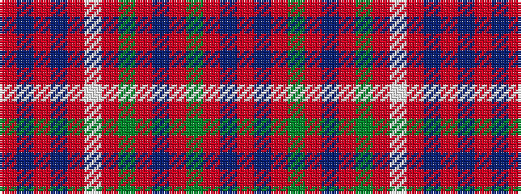

RBRBRWRGRBRGRBR

It is a 15 stripe tartan.

<figure class="pat-woven">

<figcaption>idealised sample</figcaption>
</figure>

## Colour Sequence



## Tartans with this colour sequence

| Tartans |
|---------------|
| [Walkers Shortbread](/variants/s15/r16db6r6db5r40lb3r6dg12r5dp4r5dg30r5db5r12/)|
||
