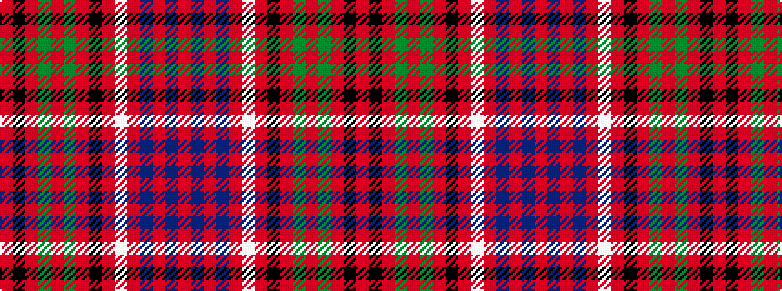

RBRBRWRKRGRGRKR

It is a 15 stripe tartan.

<figure class="pat-woven">

<figcaption>idealised sample</figcaption>
</figure>

## Colour Sequence



## Tartans with this colour sequence

| Tartans |
|---------------|
| [Drummond C](/variants/s15/r3k1r1dg6r1dg1r1k2r1lb1r6db1r1db1r3/)|
||
