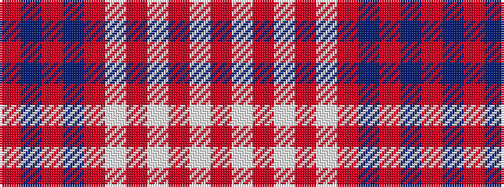

RBRBRWRWRWR

It is a 11 stripe tartan.

<figure class="pat-woven">

<figcaption>idealised sample</figcaption>
</figure>

## Colour Sequence



## Tartans with this colour sequence

| Tartans |
|---------------|
| [Unknown](/variants/s11/o3lb1o1lb1o2lb3o14dt2o2dt32r2~x2/)|
||
