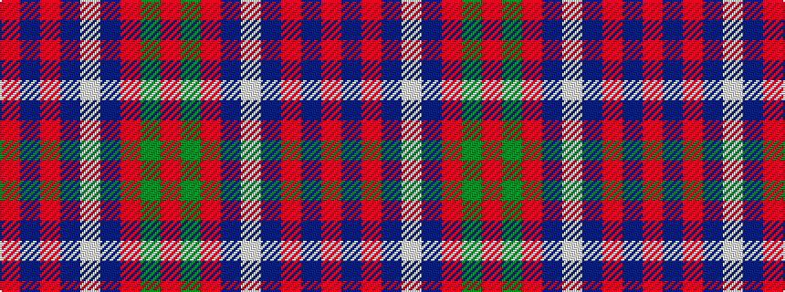

RBRBWBRGR

It is a 9 stripe tartan.

<figure class="pat-woven">

<figcaption>idealised sample</figcaption>
</figure>

## Colour Sequence



## Tartans with this colour sequence

| Tartans |
|---------------|
| [Cameron of Locheil](/variants/s9/r6dg3r6db1lb1db1r2db8r4/)|
||
| [Cameron of Lochiel](/setts/r6g3r6db1w1db1r2db8r4/)|
||
