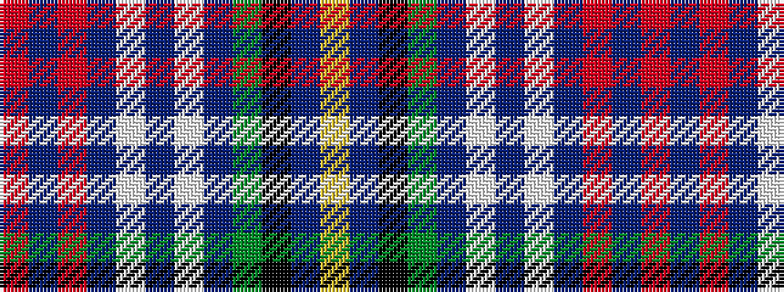

RBRBWBWBGKBY

It is a 12 stripe tartan.

<figure class="pat-woven">

<figcaption>idealised sample</figcaption>
</figure>

## Colour Sequence



## Tartans with this colour sequence

| Tartans |
|---------------|
| [Johnston, Diana Dress (Personal)](/setts/s12/r10dt4r3dt6w3dt4w3dt40dg73k4dt2ly6/)|
||
| [Johnston, Diana Dress (Personal)](/setts/s12/r10db4r3db6w3db4w3db40dg73k4db2ly6/)|
||
