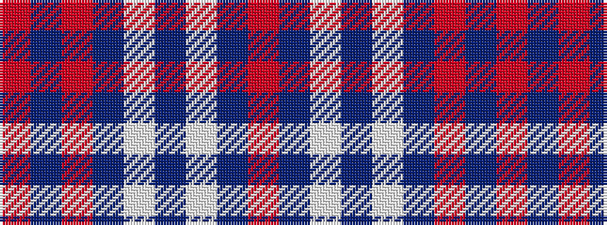

RBRBWBWBR

It is a 9 stripe tartan.

<figure class="pat-woven">

<figcaption>idealised sample</figcaption>
</figure>

## Colour Sequence



## Tartans with this colour sequence

| Tartans |
|---------------|
| [Robberstad](/setts/s9/r60b15r4dt10w2dt10w2dt10r4~x2/)|
||
