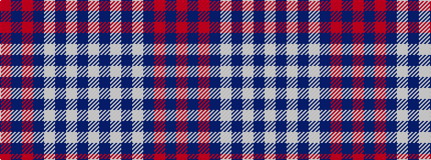

RBRBWBWBW

It is a 9 stripe tartan.

<figure class="pat-woven">

<figcaption>idealised sample</figcaption>
</figure>

## Colour Sequence



## Tartans with this colour sequence

| Tartans |
|---------------|
| [Lindsay Dress #2](/variants/s9/w29db2w2db2w2db14m31db2m3~x2/)|
||
