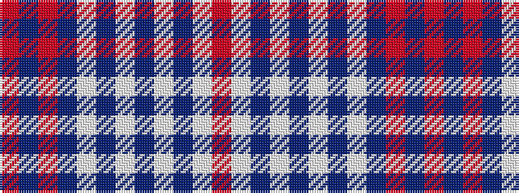

RBRBWBWBWBWR

It is a 12 stripe tartan.

<figure class="pat-woven">

<figcaption>idealised sample</figcaption>
</figure>

## Colour Sequence



## Tartans with this colour sequence

| Tartans |
|---------------|
| [St George](/setts/s12/m38db3m10db88w2db8w4db8w4db8w28r12/)|
||
