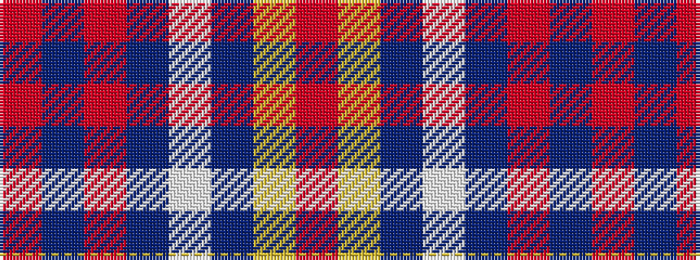

RBRBWBYR

It is a 8 stripe tartan.

<figure class="pat-woven">

<figcaption>idealised sample</figcaption>
</figure>

## Colour Sequence



## Tartans with this colour sequence

| Tartans |
|---------------|
| [Norwegian Migration Period](/variants/s8/oi30ly4dt9lb2dt1o6dt8r8~x4/)|
||
