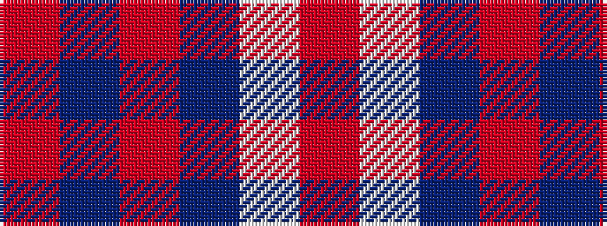

RBRBWR

It is a 6 stripe tartan.

<figure class="pat-woven">

<figcaption>idealised sample</figcaption>
</figure>

## Colour Sequence



## Tartans with this colour sequence

| Tartans |
|---------------|
| [British European](/setts/s6/r12db2r12db17w2r2~x2/)|
||
| [British European (Corporate)](/setts/s6/r12db2r12db17w2r2~x4/)|
||
