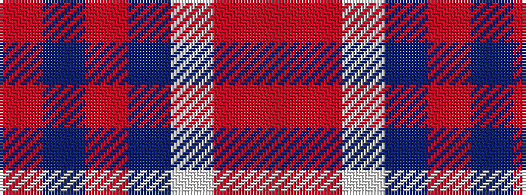

RBRBWRR

It is a 7 stripe tartan.

<figure class="pat-woven">

<figcaption>idealised sample</figcaption>
</figure>

## Colour Sequence



## Tartans with this colour sequence

| Tartans |
|---------------|
| [Barbour Dress](/variants/s7/o4do2o21db11w2oi20r3~x2/)|
||
