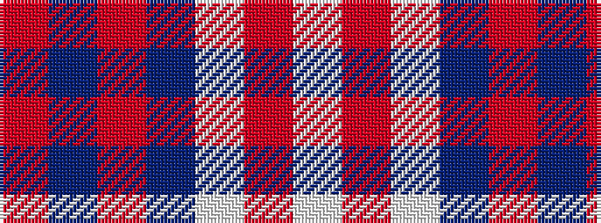

RBRBWRW

It is a 7 stripe tartan.

<figure class="pat-woven">

<figcaption>idealised sample</figcaption>
</figure>

## Colour Sequence



## Tartans with this colour sequence

| Tartans |
|---------------|
| [Lennox, dress](/variants/s7/r8p2r24p5w25o2w8~x2/)|
||
| [Lennox, dress](/variants/s7/r8p2r24db5w26o2w8~x2/)|
||
