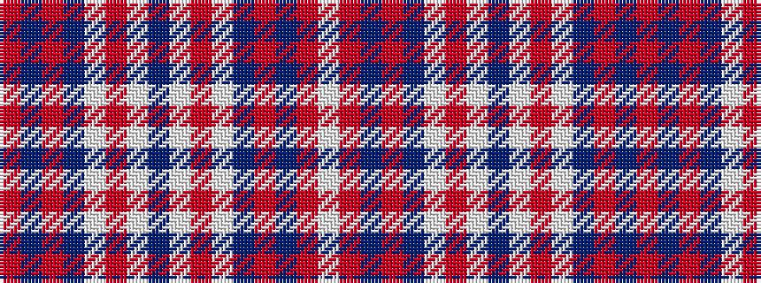

RBRBWRWBWRWBRBRW

It is a 16 stripe tartan.

<figure class="pat-woven">

<figcaption>idealised sample</figcaption>
</figure>

## Colour Sequence



## Tartans with this colour sequence

| Tartans |
|---------------|
| [Snoozzzeee](/setts/s16/lb6r3db36r4db12lb24r72lb8db4/)|
||
