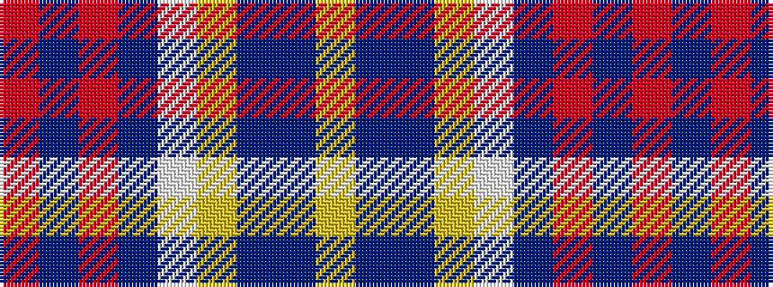

RBRBWYBBY

It is a 9 stripe tartan.

<figure class="pat-woven">

<figcaption>idealised sample</figcaption>
</figure>

## Colour Sequence



## Tartans with this colour sequence

| Tartans |
|---------------|
| [Down, County](/variants/s9/oi64dr9o11dr4lb2lo2n5dr2lo13~x2/)|
||
