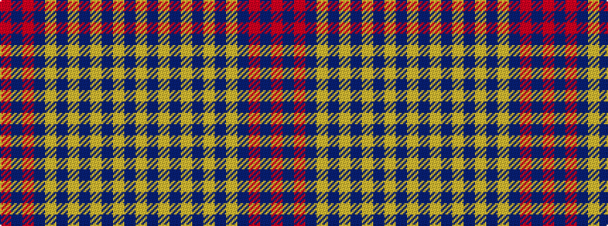

RBRBYBYBYBYBY

It is a 13 stripe tartan.

<figure class="pat-woven">

<figcaption>idealised sample</figcaption>
</figure>

## Colour Sequence



## Tartans with this colour sequence

| Tartans |
|---------------|
| [Angotta](/variants/s13/ly6db1ly1db1ly1db5ly2db5ly4db2r1db40r1~x2/)|
||
| [Angotta (Name)](/variants/s13/lo6db1lo1db1lo1db5lo2db5lo4db2r1db40r1~x2/)|
||
