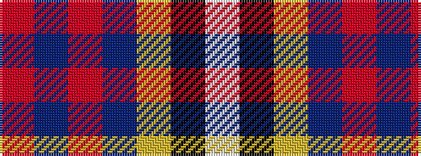

RBRBYKW

It is a 7 stripe tartan.

<figure class="pat-woven">

<figcaption>idealised sample</figcaption>
</figure>

## Colour Sequence



## Tartans with this colour sequence

| Tartans |
|---------------|
| [Loch Ness (Fashion)](/variants/s7/r2t2r2t21lg11k17lb2~x2/)|
||
