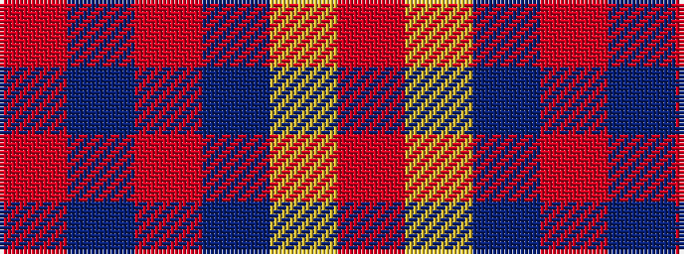

RBRBYR

It is a 6 stripe tartan.

<figure class="pat-woven">

<figcaption>idealised sample</figcaption>
</figure>

## Colour Sequence



## Tartans with this colour sequence

| Tartans |
|---------------|
| [Lauder Primary School (Corporate)](/setts/s6/r2t21r2db6ly1r1~x4/)|
||
