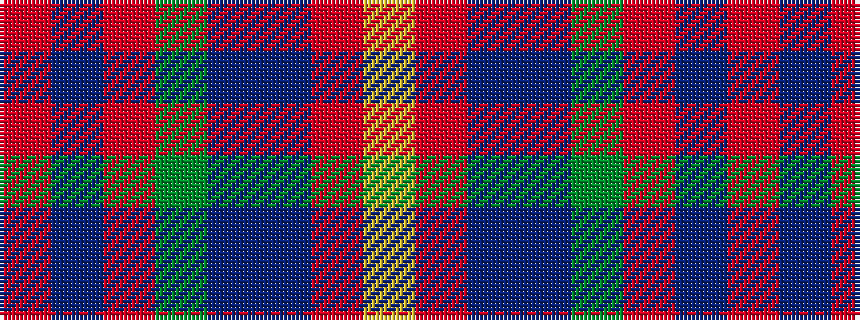

RBRGBBRY

It is a 8 stripe tartan.

<figure class="pat-woven">

<figcaption>idealised sample</figcaption>
</figure>

## Colour Sequence



## Tartans with this colour sequence

| Tartans |
|---------------|
| [Battle of Bannockburn, The](/variants/s8/r1do1r9g6t2b3r2lo1~x4/)|
||
