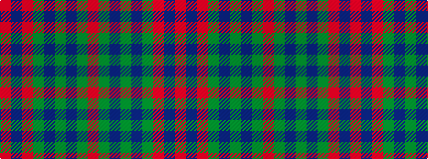

RBRGBGBGR

It is a 9 stripe tartan.

<figure class="pat-woven">

<figcaption>idealised sample</figcaption>
</figure>

## Colour Sequence



## Tartans with this colour sequence

| Tartans |
|---------------|
| [Carrick](/variants/s9/r28db12r3g20p1g2p1g2r7~x2/)|
||
| [Carrick (Clan)](/variants/s9/r28db12r3g20dp1g2dp1g2r7~x2/)|
||
