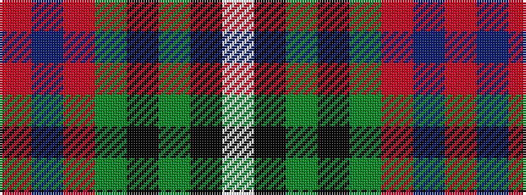

RBRGKGKW

It is a 8 stripe tartan.

<figure class="pat-woven">

<figcaption>idealised sample</figcaption>
</figure>

## Colour Sequence



## Tartans with this colour sequence

| Tartans |
|---------------|
| [Zamzam (Personal)](/setts/s8/r70b1r2g12k2g1k10w1~x2/)|
||
