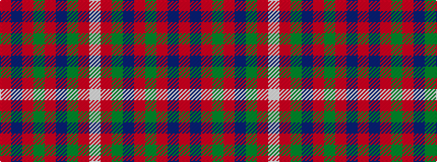

RBRGRBGRW

It is a 9 stripe tartan.

<figure class="pat-woven">

<figcaption>idealised sample</figcaption>
</figure>

## Colour Sequence



## Tartans with this colour sequence

| Tartans |
|---------------|
| [Fraser Gathering, Red (1997)](/variants/s9/r2db12r2g11r4db5g2r24w2~x2/)|
||
