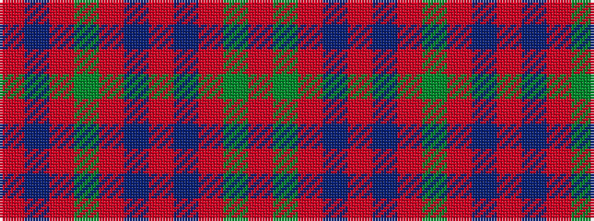

RBRGRBRBRGR

It is a 11 stripe tartan.

<figure class="pat-woven">

<figcaption>idealised sample</figcaption>
</figure>

## Colour Sequence



## Tartans with this colour sequence

| Tartans |
|---------------|
| [MacDonell of Keppoch](/setts/s11/r8g2r6db1r2db1r8g12r14db1r2~x2/)|
||
| [MacDonell of Keppoch #2](/setts/s11/r8dg2r6db1r2db1r8dg12r14db1r2~x2/)|
||
