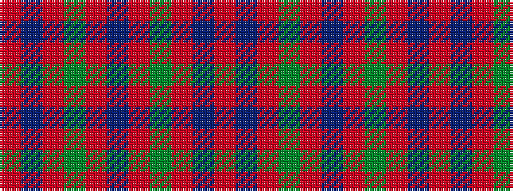

RBRGRBRGRBR

It is a 11 stripe tartan.

<figure class="pat-woven">

<figcaption>idealised sample</figcaption>
</figure>

## Colour Sequence



## Tartans with this colour sequence

| Tartans |
|---------------|
| [MacIntosh](/setts/s11/r48db12r5g21r8db1r8g21r5db12r24~x4/)|
||
