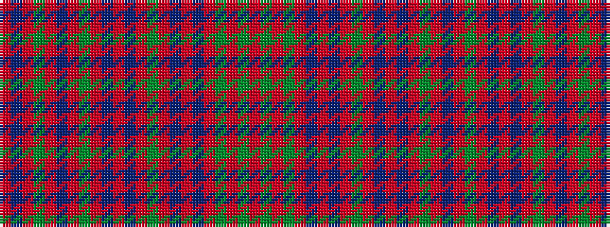

RBRGRBRGRBRBRGRBRBRGRGR

It is a 23 stripe tartan.

<figure class="pat-woven">

<figcaption>idealised sample</figcaption>
</figure>

## Colour Sequence



## Tartans with this colour sequence

| Tartans |
|---------------|
| [MacAlister](/variants/s23/r32g8r4g8r8db8r12t1r1g18r1t1r32t1r1g18r1t1r12g6r1t1r4~x2/)|
||
| [MacAlister (Cockburn Collection 1810-20)](/variants/s23/r32dg8r4dg8r8db8r12t1r1dg18r1t1r32t1r1dg18r1t1r12dg6r1t1r4~x2/)|
||
| [MacAlister CC](/variants/s23/r32dg8r4dg8r8db8r12b1r1dg18r1b1r32b1r1dg18r1b1r12dg6r1b1r4~x2/)|
||
