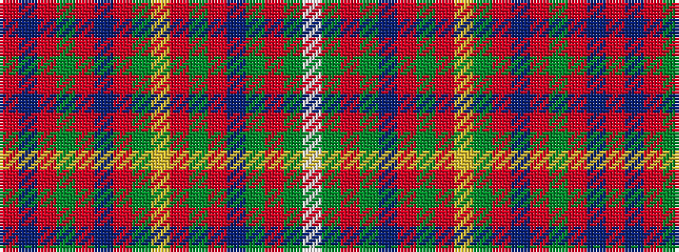

RBRGRBRGYRGRBGRGW

It is a 17 stripe tartan.

<figure class="pat-woven">

<figcaption>idealised sample</figcaption>
</figure>

## Colour Sequence



## Tartans with this colour sequence

| Tartans |
|---------------|
| [Plowman #2 (Personal)](/variants/s17/r2dp17r2dg3r2dp2r20dg1ly1r1dg2r2dp18dg2r24dg3w1~x2/)|
||
