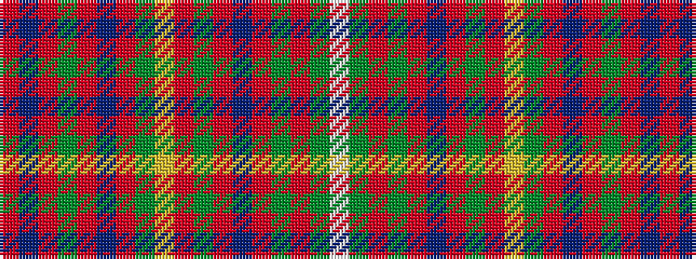

RBRGRBRGYRGRBRGRGW

It is a 18 stripe tartan.

<figure class="pat-woven">

<figcaption>idealised sample</figcaption>
</figure>

## Colour Sequence



## Tartans with this colour sequence

| Tartans |
|---------------|
| [Plowman (Personal)](/variants/s18/r2dp17r2dg3r2dp2r20dg1ly1r1dg2r2dp18r2dg2r24dg3w1~x2/)|
||
| [Unnamed C18th - S.Uist](/variants/s18/r3dp34r4dg6r4dp4r40dg2ly2r2dg4r4dp36r4dg4r48dg6w1~x2/)|
||
