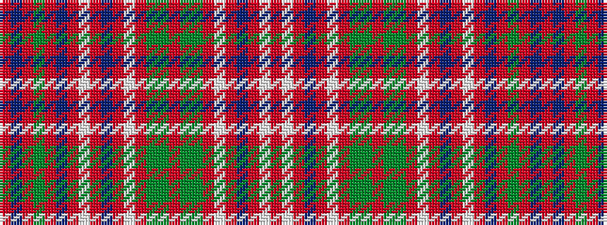

RBRGRBRWRBRWRGGRGGRWRBRWR

It is a 25 stripe tartan.

<figure class="pat-woven">

<figcaption>idealised sample</figcaption>
</figure>

## Colour Sequence



## Tartans with this colour sequence

| Tartans |
|---------------|
| [MacAlister Modern (Lochcarron)](/variants/s25/r18t1r1gi8r1t1r6w1r1db4r1w1r2gi3g1r2g1gi3r3w1r1db2r1w1r8~x2/)|
||
