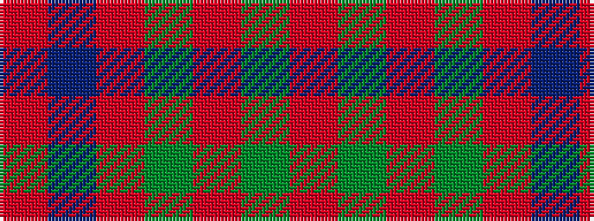

RBRGRGR

It is a 7 stripe tartan.

<figure class="pat-woven">

<figcaption>idealised sample</figcaption>
</figure>

## Colour Sequence



## Tartans with this colour sequence

| Tartans |
|---------------|
| [Williams, Jodi (Personal)](/setts/s7/o2db20r2g3r4g35r1~x2/)|
||
