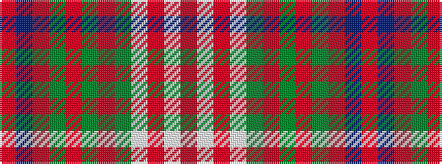

RBRGRGRGWRWR

It is a 12 stripe tartan.

<figure class="pat-woven">

<figcaption>idealised sample</figcaption>
</figure>

## Colour Sequence



## Tartans with this colour sequence

| Tartans |
|---------------|
| [Rathmore](/variants/s12/ri26b2ri6y2ri2y2o2y9w5r2w4o2~x2/)|
||
