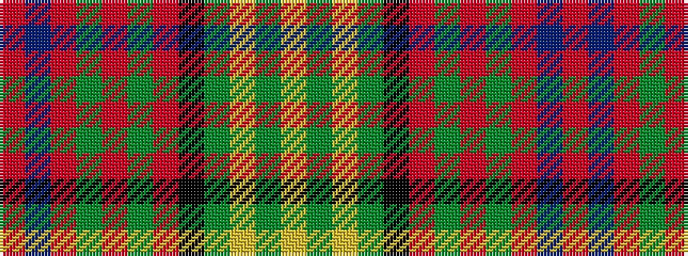

RBRGRGRKGYGY

It is a 12 stripe tartan.

<figure class="pat-woven">

<figcaption>idealised sample</figcaption>
</figure>

## Colour Sequence



## Tartans with this colour sequence

| Tartans |
|---------------|
| [Ogg of Tarragann Hunting (Personal)](/setts/s12/r2t6r1dy14r1dy14r1k6g10lo1g2lo2~x2/)|
||
