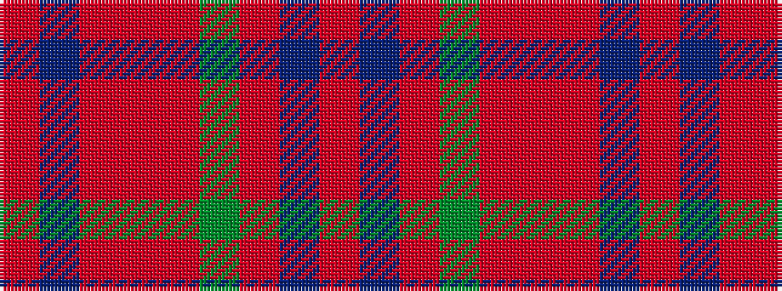

RBRGRRRBR

It is a 9 stripe tartan.

<figure class="pat-woven">

<figcaption>idealised sample</figcaption>
</figure>

## Colour Sequence



## Tartans with this colour sequence

| Tartans |
|---------------|
| [Fitzgibbon Red](/setts/s9/r2dt6r24dg2r2r1r6dt1r2~x2/)|
||
