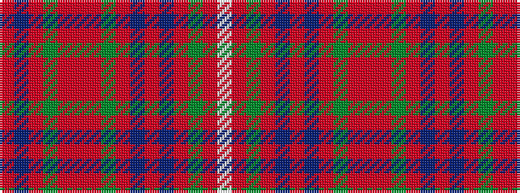

RBRGRRRGRBRBRGRW

It is a 16 stripe tartan.

<figure class="pat-woven">

<figcaption>idealised sample</figcaption>
</figure>

## Colour Sequence



## Tartans with this colour sequence

| Tartans |
|---------------|
| [Fraser, hunting](/setts/s16/w2o14g7o1db7o1db7o1g7o14r2o14g7o1db7o1~x4/)|
||
