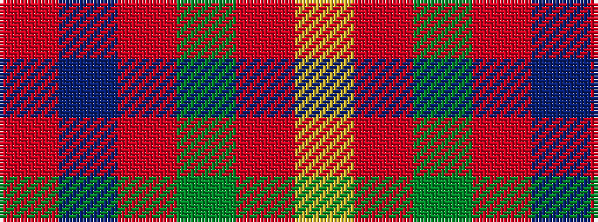

RBRGRY

It is a 6 stripe tartan.

<figure class="pat-woven">

<figcaption>idealised sample</figcaption>
</figure>

## Colour Sequence



## Tartans with this colour sequence

| Tartans |
|---------------|
| [AON](/setts/s6/r5db10r5dg5r25ly1~x4/)|
||
| [Cairn O'Mount (Personal)](/setts/s6/r58n12r5y28r7lo5~x2/)|
||
| [Fraser VS](/setts/s6/r1db6r1dg6r12lr1~x2/)|
||
