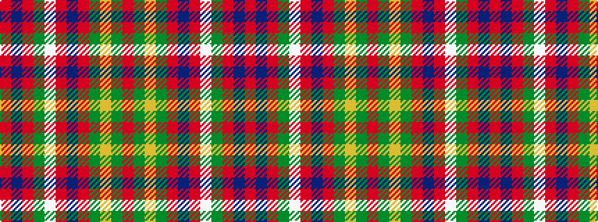

RBRGWRBRGYGR

It is a 12 stripe tartan.

<figure class="pat-woven">

<figcaption>idealised sample</figcaption>
</figure>

## Colour Sequence



## Tartans with this colour sequence

| Tartans |
|---------------|
| [Mair (Personal)](/variants/s12/r23g3ly1g3r2db18r2w1g3r2db2r23~x2/)|
||
