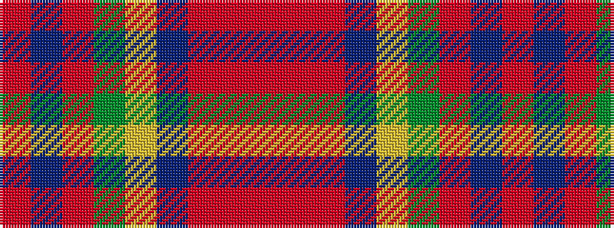

RBRGYBRRR

It is a 9 stripe tartan.

<figure class="pat-woven">

<figcaption>idealised sample</figcaption>
</figure>

## Colour Sequence



## Tartans with this colour sequence

| Tartans |
|---------------|
| [Flowers of the Forest, The](/setts/s9/r2do2r20y13lg3db5r2r4o2~x2/)|
||
