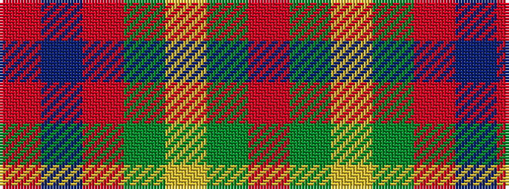

RBRGYGR

It is a 7 stripe tartan.

<figure class="pat-woven">

<figcaption>idealised sample</figcaption>
</figure>

## Colour Sequence



## Tartans with this colour sequence

| Tartans |
|---------------|
| [Gleneagles Group](/setts/s7/r5g6ly2g6r5b6r2~x2/)|
||
