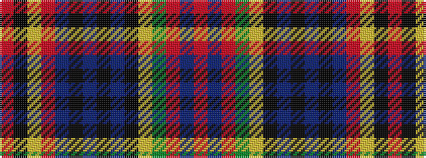

RBRGYKBKBKBRYKR

It is a 15 stripe tartan.

<figure class="pat-woven">

<figcaption>idealised sample</figcaption>
</figure>

## Colour Sequence



## Tartans with this colour sequence

| Tartans |
|---------------|
| [MacPherson](/variants/s15/r12b2r12dg8ly1k6b4k1b1k1b4r12lr1k1r1~x2/)|
||
