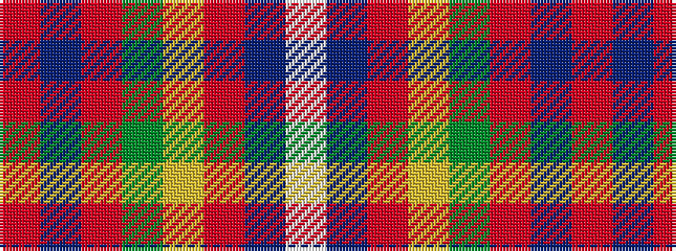

RBRGYRBW

It is a 8 stripe tartan.

<figure class="pat-woven">

<figcaption>idealised sample</figcaption>
</figure>

## Colour Sequence



## Tartans with this colour sequence

| Tartans |
|---------------|
| [Elbrick Dress (Personal)](/variants/s8/r6b22r6g20ly2r45b2w5~x2/)|
||
