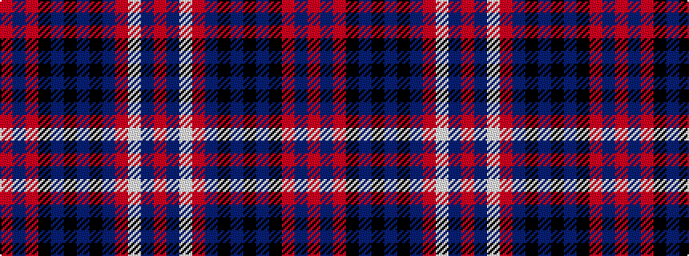

RBRKBKBKBRWBR

It is a 13 stripe tartan.

<figure class="pat-woven">

<figcaption>idealised sample</figcaption>
</figure>

## Colour Sequence



## Tartans with this colour sequence

| Tartans |
|---------------|
| [Metro Detroit Police & Fire P &](/variants/s13/r9db3r9k18db9k2db9k2db9r6w1db1r4~x2/)|
||
