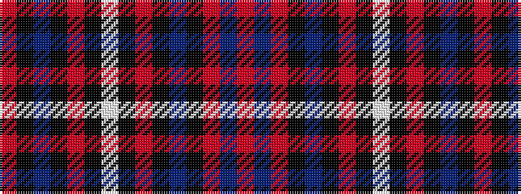

RBRKBKRKWKRKBKR

It is a 15 stripe tartan.

<figure class="pat-woven">

<figcaption>idealised sample</figcaption>
</figure>

## Colour Sequence



## Tartans with this colour sequence

| Tartans |
|---------------|
| [MacDougall #7](/setts/s15/r20b36r4k2t7k4r2k2w3k2r3k4t7k13r20~x2/)|
||
