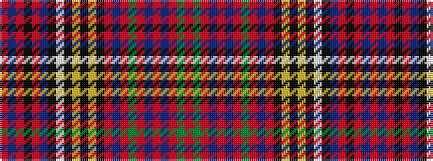

RBRKRBKWKYKYKRBRGRBRBRGR

It is a 24 stripe tartan.

<figure class="pat-woven">

<figcaption>idealised sample</figcaption>
</figure>

## Colour Sequence



## Tartans with this colour sequence

| Tartans |
|---------------|
| [Anderson (Highland Society of London)](/variants/s24/r6dg10r2db2r4db2r2dg10r4db8r2k8ly2k4ly2k4w6k6t27r2k2r2t10r6~x2/)|
||
| [Anderson 8](/variants/s24/r6g10r2db2r4db2r2g10r4db8r2k8ly2k4ly2k4w6k6t27r2k2r2t10r6~x2/)|
||
