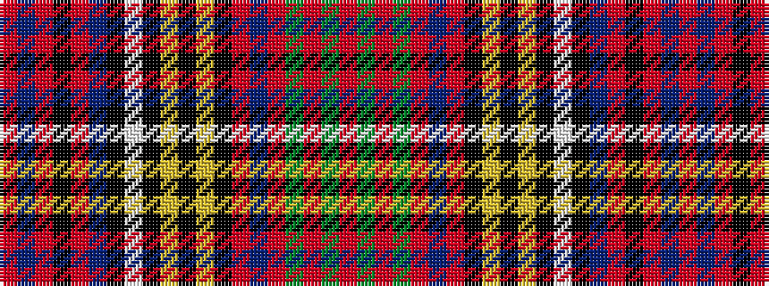

RBRKRBKWKYKYKRBRGRGR

It is a 20 stripe tartan.

<figure class="pat-woven">

<figcaption>idealised sample</figcaption>
</figure>

## Colour Sequence



## Tartans with this colour sequence

| Tartans |
|---------------|
| [Anderson 5](/variants/s20/r4g6r2g6r3db4r1k4ly1k1ly1k3w3k3t18r1k2r1t6r3~x2/)|
||
