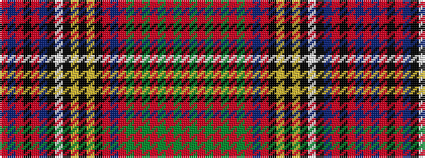

RBRKRBKWKYKYKRBRGRGRGRGR

It is a 24 stripe tartan.

<figure class="pat-woven">

<figcaption>idealised sample</figcaption>
</figure>

## Colour Sequence



## Tartans with this colour sequence

| Tartans |
|---------------|
| [Anderson (MacGregor-Hastie #4)](/setts/s24/r4dg6r1dg2r3dg2r1dg6r3db2r1k2ly1k1ly1k2w2k2t18r1k1r1t3r2~x2/)|
||
| [Anderson 2](/setts/s24/r4g6r1g2r3g2r1g6r3db2r1k2ly1k1ly1k2w2k2t18r1k1r1t3r2~x2/)|
||
