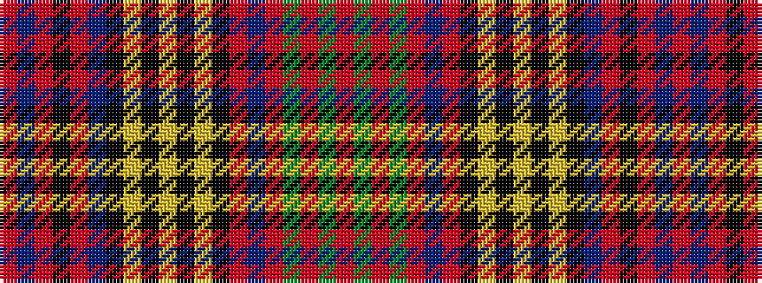

RBRKRBKYKYKYKRBRGRGR

It is a 20 stripe tartan.

<figure class="pat-woven">

<figcaption>idealised sample</figcaption>
</figure>

## Colour Sequence



## Tartans with this colour sequence

| Tartans |
|---------------|
| [Anderson](/setts/s20/r4dg6r2dg6r3db4r1k4ly1k1ly1k3lr3k3b18r1k2r1b6r3~x2/)|
||
