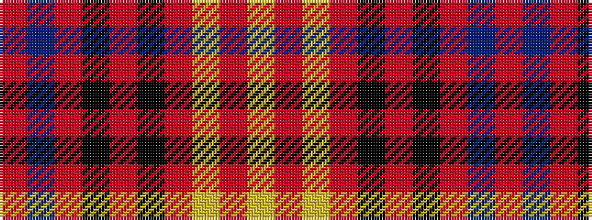

RBRKRKRYRY

It is a 10 stripe tartan.

<figure class="pat-woven">

<figcaption>idealised sample</figcaption>
</figure>

## Colour Sequence



## Tartans with this colour sequence

| Tartans |
|---------------|
| [Duffus Plaid, Lord](/variants/s10/r16t3ri12k3ri12k3ri12lo3ri12lo3~x2/)|
||
| [Duffus, Lord](/variants/s10/r16t3o12k3o12k3o12ly3o12ly3~x2/)|
||
