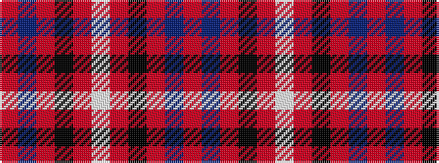

RBRKRWRKRBR

It is a 11 stripe tartan.

<figure class="pat-woven">

<figcaption>idealised sample</figcaption>
</figure>

## Colour Sequence



## Tartans with this colour sequence

| Tartans |
|---------------|
| [Varenne](/setts/s11/o32do4r2k8r3lb2r3k8r2do4r30~x2/)|
||
