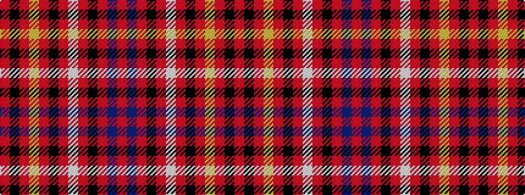

RBRKRWRKRYRKR

It is a 13 stripe tartan.

<figure class="pat-woven">

<figcaption>idealised sample</figcaption>
</figure>

## Colour Sequence



## Tartans with this colour sequence

| Tartans |
|---------------|
| [First Special Service Force](/variants/s13/r8k14r6ly6r34k10r6w6r6k64r44b9r6/)|
||
| [First Special Service Force](/variants/s13/r8k14r6ly6r34k10r6w6r6k64r44db9r6/)|
||
| [First Special Services Forces (Mil)](/variants/s13/r4k9r3ly3r18k4r2w2r2k36r24db4r3~x2/)|
||
