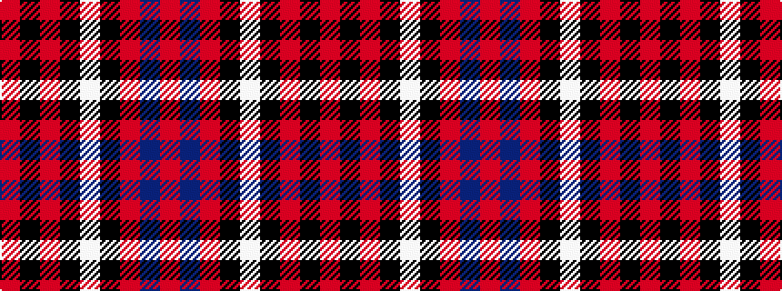

RBRKWKRKR

It is a 9 stripe tartan.

<figure class="pat-woven">

<figcaption>idealised sample</figcaption>
</figure>

## Colour Sequence



## Tartans with this colour sequence

| Tartans |
|---------------|
| [Cameron of Locheil #3](/variants/s9/r24db8r23k4w4k4r10k32r8/)|
||
