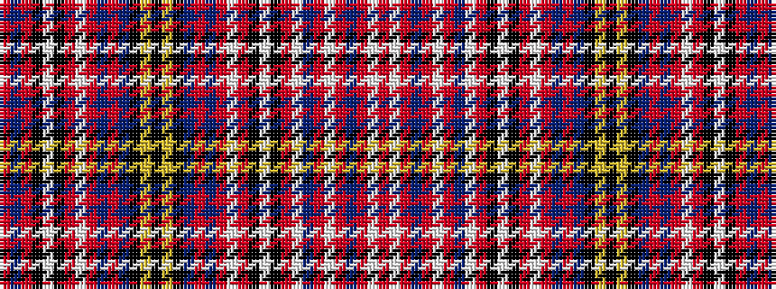

RBRKWKRWRBRBKYKYKBRBRWRKWKRWBRWRBRWR

It is a 36 stripe tartan.

<figure class="pat-woven">

<figcaption>idealised sample</figcaption>
</figure>

## Colour Sequence



## Tartans with this colour sequence

| Tartans |
|---------------|
| [Unidentified Plaid arisaid](/variants/s36/r6w16r6db1r6w16r6db9w140r55k2w4k2r16w20r16db6r2db27k4ly4k6ly4k4db27r2db6r16w20r16k2w4k2r55db1r6~x2/)|
||
