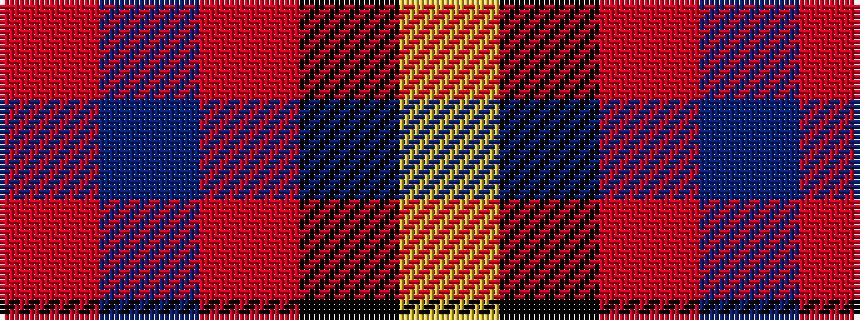

RBRKY

It is a 5 stripe tartan.

<figure class="pat-woven">

<figcaption>idealised sample</figcaption>
</figure>

## Colour Sequence



## Tartans with this colour sequence

| Tartans |
|---------------|
| [New York State Police Pipe Band](/variants/s5/o5dp3o18k16ly3~x4/)|
||
